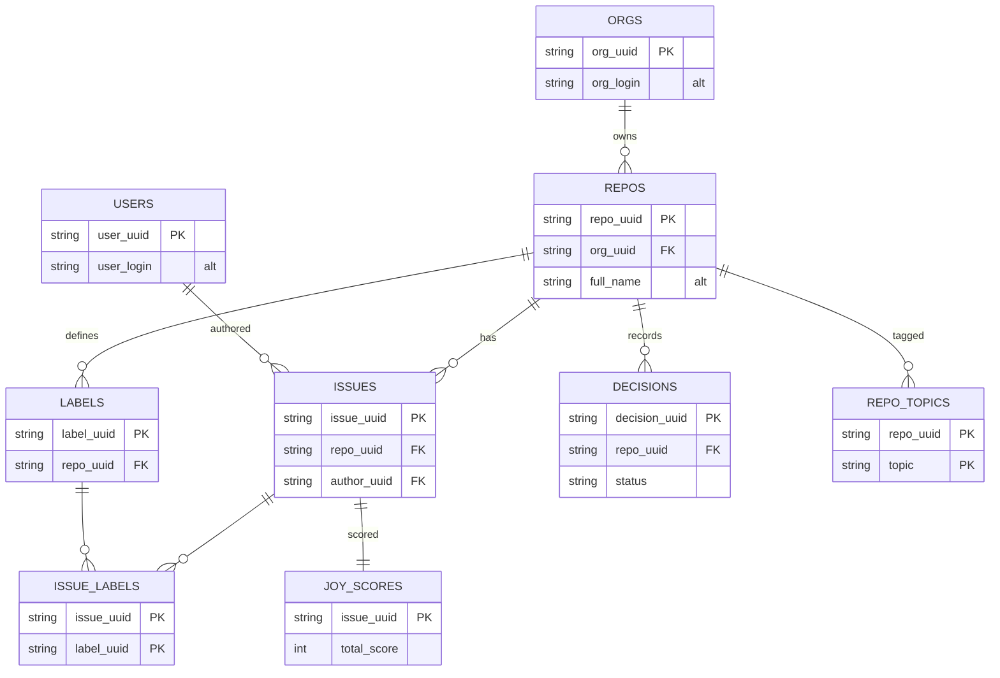

# Schema — parquet datalake in Essential Tuple Normal Form (ETNF)

Every table lives in `lake/*.parquet`. Keys are **deterministic UUIDv5** (a namespaced
SHA-1 of each row's natural key), so they are reproducible and stable across snapshots
without depending on GitHub's internal integer ids. The natural key is kept as a column,
so it remains an alternate candidate key.

```
NS = uuid5(NAMESPACE_URL, "chibifire.com/study-data-vsk")
org_uuid      = uuid5(NS, "org:"      + login)
repo_uuid     = uuid5(NS, "repo:"     + full_name)
user_uuid     = uuid5(NS, "user:"     + login)
issue_uuid    = uuid5(NS, "issue:"    + full_name + "#" + number)
label_uuid    = uuid5(NS, "label:"    + full_name + ":" + label_name)
decision_uuid = uuid5(NS, "decision:" + full_name + ":" + path)
snapshot_uuid = uuid5(NS, "snapshot:" + captured_at)
```

## Entity–relationship



## Tables

| Table          | Key                         | Notes                                                                                                                                      |
| -------------- | --------------------------- | ------------------------------------------------------------------------------------------------------------------------------------------ |
| `snapshot`     | `snapshot_uuid`             | one row: capture time, orgs, query, tool versions (provenance)                                                                             |
| `orgs`         | `org_uuid`                  | + `org_login` (alt key), name, public_repos, created_at                                                                                    |
| `repos`        | `repo_uuid`                 | + `full_name` (alt key), `org_uuid` FK, stars, archived, fork, open_issues_count, language, pushed_at, …                                   |
| `users`        | `user_uuid`                 | + `user_login` (alt key), user_type                                                                                                        |
| `issues`       | `issue_uuid`                | `repo_uuid` FK, `author_uuid` FK, number, title, state, comments, created_at, body_len, html_url — **no** full_name (repo_uuid-determined) |
| `labels`       | `label_uuid`                | `repo_uuid` FK, name, color, description                                                                                                   |
| `decisions`    | `decision_uuid`             | `repo_uuid` FK, path, title, date, **status**, tier — MADRs from the manuals repos                                                         |
| `issue_labels` | (`issue_uuid`,`label_uuid`) | all-key junction                                                                                                                           |
| `repo_topics`  | (`repo_uuid`,`topic`)       | all-key junction                                                                                                                           |
| `joy_scores`   | `issue_uuid`                | derived: finishability, haunting, doability, total_score, rank, reasons                                                                    |

## Why this is ETNF

ETNF (Essential Tuple Normal Form) sits between 4NF and 5NF: a relation is in ETNF iff it
is in BCNF **and** for every explicit nontrivial join dependency, at least one component is
a superkey. It removes the redundancy that join dependencies cause, without demanding full
5NF decomposition.

1. Every many-to-many fact is a binary all-key junction. An issue relates to many
   labels and a repo to many topics. Rather than repeat labels inside an issue row (which
   would introduce a join dependency with redundancy), those facts live in `issue_labels`
   and `repo_topics`. Each is an all-key relation: the entire heading is the key, so its
   only nontrivial join dependency reconstructs the whole tuple and every component is a
   superkey — the ETNF condition holds (these are in fact 5NF).

2. Entity relations are BCNF with no nontrivial JD. `orgs`, `repos`, `users`, `issues`,
   `labels`, `decisions`, `snapshot` each have candidate keys (the `*_uuid` and the retained
   natural key); every non-key attribute is fully functionally dependent on the whole key and
   on nothing else. With no nontrivial join dependency present, BCNF ⇒ ETNF trivially.

3. No transitive or derived attribute is stored redundantly. `issues` carries only `repo_uuid`
   (not `full_name` or org), because `repo_uuid → full_name → org_uuid` already holds in
   `repos`. Storing `full_name` on `issues` would be a redundant transitive dependency; it is
   obtained by join instead. `joy_scores` is a 1:1 derived extension of `issues`, keyed by
   `issue_uuid`.

Integrity is enforced on every build (`normalize.py`): each PK is checked unique and every FK
is checked to resolve into its parent (no orphans).
